# 📊 SCRIPT THUYẾT TRÌNH: TRỰC QUAN HÓA DEADLOCK (VISUALIZATION)

---

## 🎯 SLIDE 1: GIỚI THIỆU TỔNG QUAN

**Nói:**
> "Xin chào mọi người! Phần cuối cùng em sẽ trình bày về **Visualization** - Trực quan hóa đồ thị Wait-For Graph. Đây là công cụ hỗ trợ để **nhìn thấy** deadlock một cách trực quan, giúp debug và trình bày dễ hiểu hơn."

### Tại sao cần Visualization?
```
Kết quả text:                      Kết quả hình ảnh:
"DEADLOCK cycle: P0 P1 P2 P0"      
                                        ┌───┐
    Khó hình dung!              ┌──────→│P0 │──────┐
                                │       └───┘      │
                                │         ↑        ▼
                              ┌───┐              ┌───┐
                              │P2 │←─────────────│P1 │
                              └───┘              └───┘
                                   
                                   Dễ hiểu hơn nhiều! ✅
```

### Bộ công cụ visualization:
| Tool | Chức năng |
|------|-----------|
| `wfg_check` | Kiểm tra deadlock từ file input |
| `wfg_to_dot` | Chuyển đồ thị sang định dạng DOT |
| `dot2png.sh` | Chuyển file DOT sang hình PNG |

---

## 🎯 SLIDE 2: GRAPHVIZ VÀ NGÔN NGỮ DOT

**Nói:**
> "Chúng ta sử dụng **Graphviz** - một công cụ mã nguồn mở để vẽ đồ thị. Graphviz đọc file định dạng **DOT** và xuất ra hình ảnh."

### Graphviz là gì?
- Bộ công cụ vẽ đồ thị miễn phí
- Hỗ trợ nhiều layout: directed, undirected, hierarchical
- Output: PNG, SVG, PDF, ...
- Cài đặt:
  ```bash
  # Ubuntu/Debian
  sudo apt-get install graphviz
  
  # Windows (Chocolatey)
  choco install graphviz
  
  # macOS
  brew install graphviz
  ```

### Ngôn ngữ DOT:

```dot
digraph WFG {
    rankdir=LR;                    // Hướng trái-phải
    node [shape=circle];           // Node hình tròn
    
    P0 -> P1;                      // Cạnh P0 → P1
    P1 -> P2;                      // Cạnh P1 → P2
    P2 -> P0 [color=red];          // Cạnh màu Ä‘á»
}
```


### Kết quả:
```
    ┌────────────────────────────┐
    │                            │
    ▼                            │
  ┌───┐      ┌───┐      ┌───┐   │
  │P0 │ ───→ │P1 │ ───→ │P2 │ ──┘ (đỏ)
  └───┘      └───┘      └───┘
```

---

## 🎯 SLIDE 3: CÔNG CỤ WFG_CHECK - KIỂM TRA NHANH

**Nói:**
> "Đầu tiên là `wfg_check` - công cụ đơn giản để kiểm tra deadlock từ file input."

### Code wfg_check.c:
```c
#include "graph.h"
#include "util.h"
#include <stdio.h>
#include <stdlib.h>

int main(int argc, char **argv) {
    // Mở file input (hoặc đọc từ stdin)
    if (argc == 2) {
        if (!freopen(argv[1], "r", stdin)) { 
            perror("freopen"); 
            return EX_BAD_INPUT; 
        }
    }
    
    // Đọc N (số node) và E (số cạnh)
    int N, E;
    if (scanf("%d %d", &N, &E) != 2 || N <= 0 || E < 0) { 
        fprintf(stderr, "Bad N E\n"); 
        return EX_BAD_INPUT; 
    }
    
    // Tạo đồ thị và thêm cạnh
    graph_t *g = graph_new(N);
    for (int i = 0; i < E; i++) {
        int u, v;
        if (scanf("%d %d", &u, &v) != 2) { 
            fprintf(stderr, "Bad edge\n"); 
            graph_free(g); 
            return EX_BAD_INPUT; 
        }
        graph_add_edge(g, u, v);
    }
    
    // Tìm chu trình
    int *cyc = NULL; 
    size_t clen = 0;
    
    if (graph_find_cycle(g, &cyc, &clen)) {
        // CÓ chu trình = DEADLOCK
        printf("DEADLOCK cycle: ");
        for (size_t i = 0; i < clen; i++) {
            printf("P%d%s", cyc[i], (i+1 < clen) ? " " : "");
        }
        printf("\n");
        free(cyc);
        graph_free(g);
        return EX_DEADLOCK;    // Exit code 1
    } else {
        // Không có chu trình
        printf("NO DEADLOCK\n");
        graph_free(g);
        return EX_OK;          // Exit code 0
    }
}
```

### Cách sử dụng:
```bash
# Kiểm tra file có deadlock không
./wfg_check tests/wfg/01_cycle.in
# Output: DEADLOCK cycle: P0 P1 P2 P0

./wfg_check tests/wfg/02_nocycle.in  
# Output: NO DEADLOCK

# Có thể dùng exit code trong script
./wfg_check test.in && echo "Safe" || echo "Deadlock!"
```

---

## 🎯 SLIDE 4: CÔNG CỤ WFG_TO_DOT - CHUYỂN SANG DOT

**Nói:**
> "Công cụ chính là `wfg_to_dot` - chuyển đồ thị WFG sang file DOT để vẽ."

### Luồng hoạt động:
```
┌─────────────┐     ┌─────────────┐     ┌─────────────┐     ┌─────────────┐
│  input.in   │────→│ wfg_to_dot  │────→│  output.dot │────→│  dot2png.sh │
│             │     │             │     │             │     │             │
│  4 4        │     │ • Đọc đồ thị│     │ digraph WFG │     │             │
│  0 1        │     │ • Tìm cycle │     │ { ... }     │     │             │
│  1 2        │     │ • Tô màu đỏ │     │             │     │             │
│  2 3        │     │ • Xuất DOT  │     │             │     │             │
│  3 0        │     │             │     │             │     │             │
└─────────────┘     └─────────────┘     └─────────────┘     └─────────────┘
                                                                   │
                                                                   ▼
                                                            ┌─────────────┐
                                                            │ output.png  │
                                                            │   [HÌNH]    │
                                                            └─────────────┘
```

### Cách sử dụng:
```bash
# Chuyển input.in → output.dot
./wfg_to_dot input.in output.dot

# Nếu không chỉ định output, mặc định là out.dot
./wfg_to_dot input.in
# → Tạo file out.dot
```

---

## 🎯 SLIDE 5: CODE WFG_TO_DOT - PHẦN 1: ĐỌC INPUT

**Nói:**
> "Hãy phân tích code của wfg_to_dot từng phần."

### Cấu trúc dữ liệu:
```c
// Lưu thông tin một cạnh
typedef struct { 
    int u, v;    // Cạnh từ u đến v
} Edge;
```

### Code đọc input:
```c
int main(int argc, char** argv) {
    // Kiểm tra tham số
    if (argc < 2 || argc > 3) {
        fprintf(stderr, "Usage: %s input.in [output.dot]\n", argv[0]);
        return EX_BAD_INPUT;
    }
    
    const char* in  = argv[1];                           // File input
    const char* out = (argc == 3) ? argv[2] : "out.dot"; // File output
    
    // Mở file input
    if (!freopen(in, "r", stdin)) { 
        perror("freopen"); 
        return EX_BAD_INPUT; 
    }
    
    // Đọc N và E
    int N, E;
    if (scanf("%d %d", &N, &E) != 2 || N <= 0 || E < 0) { 
        fprintf(stderr, "Bad N E\n"); 
        return EX_BAD_INPUT; 
    }
    
    // Cấp phát mảng cạnh
    Edge *edges = (Edge*)xmalloc((size_t)E * sizeof(*edges));
    
    // Tạo đồ thị và đọc các cạnh
    graph_t *g = graph_new(N);
    for (int i = 0; i < E; i++) {
        int u, v;
        if (scanf("%d %d", &u, &v) != 2) { 
            fprintf(stderr, "Bad edge\n"); 
            free(edges); 
            graph_free(g); 
            return EX_BAD_INPUT; 
        }
        edges[i].u = u;          // Lưu vào mảng
        edges[i].v = v;
        graph_add_edge(g, u, v); // Thêm vào đồ thị
    }
```

---

## 🎯 SLIDE 6: CODE WFG_TO_DOT - PHẦN 2: TÌM CHU TRÌNH

**Nói:**
> "Sau khi đọc xong, ta tìm chu trình để biết cần tô màu đỏ những gì."

### Code:
```c
    // Tìm chu trình trong đồ thị
    int* cyc_ids = NULL; 
    size_t clen = 0;
    
    // Gọi hàm tìm chu trình (có/không đều xuất DOT)
    (void)graph_find_cycle(g, &cyc_ids, &clen);
    
    // Gọi hàm xuất file DOT
    write_dot(out, N, E, edges, cyc_ids, clen);
    
    // In kết quả ra console
    if (cyc_ids) {
        printf("DEADLOCK cycle: ");
        for (size_t i = 0; i < clen; i++) {
            printf("P%d%s", cyc_ids[i], (i+1 < clen) ? " " : "");
        }
        printf("\n");
        free(cyc_ids);
    } else {
        printf("NO DEADLOCK\n");
    }
    
    // Giải phóng bộ nhớ
    free(edges);
    graph_free(g);
    return EX_OK;
}
```

### Lưu ý:
```
• Dù có hay không có chu trình, đều xuất file DOT
• Nếu có chu trình: các node/edge trong chu trình được tô màu ĐỎ
• Nếu không có: đồ thị bình thường (màu đen)
```

---

## 🎯 SLIDE 7: CODE WFG_TO_DOT - PHẦN 3: HÀM WRITE_DOT ⭐

**Nói:**
> "Đây là hàm quan trọng nhất - sinh ra file DOT với màu sắc phù hợp."

### Code:
```c
static void write_dot(const char* path, int N, int E, const Edge* edges,
                      const int* cyc, size_t clen) {
    // Mở file output
    FILE* f = fopen(path, "w");
    if (!f) { perror("fopen dot"); exit(EX_INTERNAL); }
    
    // Mảng đánh dấu node/edge thuộc chu trình
    bool *in_node = (bool*)xcalloc((size_t)N, sizeof(bool));
    bool *in_edge = (bool*)xcalloc((size_t)E, sizeof(bool));
    
    // Đánh dấu các node và edge trong chu trình
    if (cyc && clen > 1) {
        for (size_t i = 0; i < clen; i++) {
            int a = cyc[i];
            int b = cyc[(i+1) % clen];  // Chu trình đóng (cuối nối về đầu)
            
            // Đánh dấu node
            if (a >= 0 && a < N) in_node[a] = true;
            if (b >= 0 && b < N) in_node[b] = true;
            
            // Tìm và đánh dấu cạnh a → b
            for (int k = 0; k < E; k++) {
                if (edges[k].u == a && edges[k].v == b) { 
                    in_edge[k] = true; 
                    break; 
                }
            }
        }
    }
```

---

## 🎯 SLIDE 8: CODE WFG_TO_DOT - PHẦN 4: XUẤT DOT

**Nói:**
> "Tiếp theo là phần xuất nội dung file DOT."

### Code xuất DOT:
```c
    // Header của file DOT
    fprintf(f, "digraph WFG {\n");
    fprintf(f, "  rankdir=LR;\n");                              // Hướng trái→phải
    fprintf(f, "  node [shape=circle, fontsize=11];\n");        // Node hình tròn
    
    // Xuất các node
    for (int i = 0; i < N; i++) {
        if (in_node[i]) 
            // Node trong chu trình → màu ĐỎ
            fprintf(f, "  P%d [color=red, fontcolor=red];\n", i);
        else           
            // Node bình thường
            fprintf(f, "  P%d;\n", i);
    }
    
    // Xuất các cạnh
    for (int k = 0; k < E; k++) {
        const char* attr = in_edge[k] 
            ? "[color=red, penwidth=2.0]"   // Cạnh trong chu trình → đỏ, đậm
            : "";                            // Cạnh bình thường
        fprintf(f, "  P%d -> P%d %s;\n", edges[k].u, edges[k].v, attr);
    }
    
    fprintf(f, "}\n");
    fclose(f);
    
    free(in_node); 
    free(in_edge);
}
```

---

## 🎯 SLIDE 9: VÍ DỤ FILE DOT ĐƯỢC TẠO RA

**Nói:**
> "Hãy xem ví dụ file DOT được tạo ra."

### Input (test.in):
```
4 5
0 1
1 2
2 3
3 0
0 2
```

### Output (test.dot):

```dot
digraph WFG {
  rankdir=LR;
  node [shape=circle, fontsize=11];
  
  P0 [color=red, fontcolor=red];    // ↠Trong chu trình
  P1 [color=red, fontcolor=red];    // ↠Trong chu trình
  P2 [color=red, fontcolor=red];    // ↠Trong chu trình
  P3 [color=red, fontcolor=red];    // ↠Trong chu trình
  
  P0 -> P1 [color=red, penwidth=2.0];   // ↠Cạnh chu trình
  P1 -> P2 [color=red, penwidth=2.0];   // ↠Cạnh chu trình
  P2 -> P3 [color=red, penwidth=2.0];   // ↠Cạnh chu trình
  P3 -> P0 [color=red, penwidth=2.0];   // ↠Cạnh chu trình
  P0 -> P2 ;                             // ↠Cạnh thÆ°á»ng (không trong chu trình)
}
```


### Giải thích:
```
Chu trình: P0 → P1 → P2 → P3 → P0  (tô đỏ)
Cạnh P0 → P2 không thuộc chu trình (màu đen)
```

---

## 🎯 SLIDE 10: SCRIPT DOT2PNG.SH

**Nói:**
> "Cuối cùng là script shell để chuyển file DOT thành hình PNG."

### Code dot2png.sh:
```bash
#!/usr/bin/env bash
set -euo pipefail

# Kiểm tra Graphviz đã cài chưa
if ! command -v dot >/dev/null 2>&1; then
  echo "Graphviz 'dot' chưa cài. Cài: sudo apt-get install graphviz" >&2
  exit 1
fi

# Kiểm tra tham số
if [ $# -lt 1 ] || [ $# -gt 2 ]; then
  echo "Usage: $0 input.dot [output.png]" >&2
  exit 1
fi

# Lấy tên file input và output
in="$1"
out="${2:-${in%.dot}.png}"    # Mặc định: input.dot → input.png

# Gọi Graphviz để render
dot -Tpng "$in" -o "$out"

echo "Wrote $out"
```

### Giải thích từng dòng:
| Dòng | Ý nghĩa |
|------|---------|
| `set -euo pipefail` | Dừng khi có lỗi |
| `command -v dot` | Kiểm tra lệnh `dot` có tồn tại không |
| `${in%.dot}.png` | Thay đuôi .dot bằng .png |
| `dot -Tpng` | Render ra định dạng PNG |

### Cách sử dụng:
```bash
# Cách 1: Chỉ định input, output tự động
./dot2png.sh graph.dot
# → Tạo graph.png

# Cách 2: Chỉ định cả input và output
./dot2png.sh graph.dot result.png
# → Tạo result.png
```

---

## 🎯 SLIDE 11: QUY TRÌNH HOÀN CHỈNH

**Nói:**
> "Đây là quy trình hoàn chỉnh từ file input đến hình ảnh."

### Pipeline:
```bash
# Bước 1: Chuẩn bị file input
cat > test.in << EOF
4 4
0 1
1 2
2 3
3 0
EOF

# Bước 2: Chuyển sang DOT
./wfg_to_dot test.in test.dot
# Output: DEADLOCK cycle: P0 P1 P2 P3 P0

# Bước 3: Render hình PNG
./dot2png.sh test.dot test.png
# Output: Wrote test.png

# Hoặc gộp lại:
./wfg_to_dot test.in test.dot && ./dot2png.sh test.dot
```

### Sơ đồ pipeline:
```
┌──────────┐      ┌──────────┐      ┌──────────┐      ┌──────────┐
│ test.in  │─────→│wfg_to_dot│─────→│ test.dot │─────→│ dot2png  │
│          │      │          │      │          │      │          │
│ 4 4      │      │          │      │ digraph  │      │          │
│ 0 1      │      │          │      │ WFG {...}│      │          │
│ 1 2      │      │          │      │          │      │          │
│ 2 3      │      │          │      │          │      │          │
│ 3 0      │      │          │      │          │      │          │
└──────────┘      └──────────┘      └──────────┘      └──────────┘
                                                            │
                                                            ▼
                                                      ┌──────────┐
                                                      │ test.png │
                                                      │          │
                                                      │  [HÌNH   │
                                                      │  ĐỒ THỊ] │
                                                      │          │
                                                      └──────────┘
```

---

## 🎯 SLIDE 12: VÍ DỤ HÌNH ẢNH OUTPUT

**Nói:**
> "Đây là các ví dụ hình ảnh được tạo ra."

### Ví dụ 1: Có Deadlock (chu trình 4 node)
```
Input: 4 4           Output PNG:
       0 1           
       1 2               ┌───────────────────────────┐
       2 3               │                           │
       3 0               │   ┌───┐     ┌───┐        │
                         │   │P0 │────→│P1 │        │
                         │   └───┘     └───┘        │
                         │     ↑         │          │
                         │     │         ↓          │
                         │   ┌───┐     ┌───┐        │
                         │   │P3 │←────│P2 │        │
                         │   └───┘     └───┘        │
                         │                           │
                         │   (Tất cả màu ĐỎ)        │
                         └───────────────────────────┘
```

### Ví dụ 2: Không có Deadlock (DAG)
```
Input: 4 3           Output PNG:
       0 1           
       0 2               ┌───────────────────────────┐
       1 3               │                           │
                         │         ┌───┐             │
                         │    ┌───→│P1 │───┐        │
                         │    │    └───┘   │        │
                         │  ┌───┐          ▼        │
                         │  │P0 │        ┌───┐      │
                         │  └───┘        │P3 │      │
                         │    │          └───┘      │
                         │    └───→┌───┐            │
                         │         │P2 │            │
                         │         └───┘            │
                         │                           │
                         │   (Tất cả màu ĐEN)       │
                         └───────────────────────────┘
```

### Ví dụ 3: Có Deadlock trong đồ thị lớn
```
Input: 6 7           Output PNG:
       0 1           
       1 2               ┌───────────────────────────────┐
       2 0     ← cycle   │                               │
       3 4               │  ┌───┐    ┌───┐    ┌───┐     │
       4 5               │  │P0 │───→│P1 │───→│P2 │     │
       0 3               │  └───┘    └───┘    └───┘     │
       1 4               │    ↑                 │       │
                         │    └─────────────────┘       │
                         │    (CHU TRÌNH - MÀU ĐỎ)      │
                         │                               │
                         │  ┌───┐    ┌───┐    ┌───┐     │
                         │  │P3 │───→│P4 │───→│P5 │     │
                         │  └───┘    └───┘    └───┘     │
                         │    (MÀU ĐEN - không trong    │
                         │     chu trình)               │
                         └───────────────────────────────┘
```

---

## 🎯 SLIDE 13: CÁC THUỘC TÍNH DOT HỮU ÍCH

**Nói:**
> "Có thể tùy chỉnh thêm file DOT để đẹp hơn."

### Các thuộc tính node:
```dot
// Hình dạng
node [shape=circle];        // Hình tròn
node [shape=box];           // Hình chữ nhật
node [shape=ellipse];       // Hình elip
node [shape=doublecircle];  // Hai vòng tròn

// Màu sắc
P0 [color=red];              // Viền đỏ
P0 [fillcolor=yellow, style=filled];  // Nền vàng
P0 [fontcolor=blue];         // Chữ xanh

// Kích thước
P0 [fontsize=14];            // Cỡ chữ
P0 [width=1.5, height=1];    // Kích thước node
```

### Các thuộc tính edge:
```dot
// Màu và độ dày
P0 -> P1 [color=red];              // Màu đỏ
P0 -> P1 [penwidth=3.0];           // Đường đậm
P0 -> P1 [style=dashed];           // Nét đứt
P0 -> P1 [style=bold];             // Nét đậm

// Nhãn
P0 -> P1 [label="wait"];           // Thêm nhãn
P0 -> P1 [xlabel="chờ"];           // Nhãn bên ngoài

// Mũi tên
P0 -> P1 [arrowhead=vee];          // Kiểu mũi tên
P0 -> P1 [arrowsize=1.5];          // Kích thước mũi tên
```

### Các thuộc tính graph:
```dot
digraph WFG {
    rankdir=LR;     // Left-Right (trái→phải)
    rankdir=TB;     // Top-Bottom (trên→dưới)
    rankdir=BT;     // Bottom-Top (dưới→trên)
    rankdir=RL;     // Right-Left (phải→trái)
    
    bgcolor=white;  // Màu nền
    splines=true;   // Đường cong mềm mại
    nodesep=0.5;    // Khoảng cách giữa các node
}
```

---

## 🎯 SLIDE 14: MỞ RỘNG - EXPORT ĐỊNH DẠNG KHÁC

**Nói:**
> "Graphviz hỗ trợ nhiều định dạng output khác nhau."

### Các định dạng output:
```bash
# PNG - Hình ảnh raster
dot -Tpng input.dot -o output.png

# SVG - Vector (scalable)
dot -Tsvg input.dot -o output.svg

# PDF - Tài liệu
dot -Tpdf input.dot -o output.pdf

# PS - PostScript
dot -Tps input.dot -o output.ps

# Plain text - Tọa độ
dot -Tplain input.dot -o output.txt
```

### So sánh định dạng:
| Format | Ưu điểm | Nhược điểm |
|--------|---------|------------|
| PNG | Phổ biến, nhẹ | Mờ khi zoom |
| SVG | Rõ nét mọi kích thước | Cần trình duyệt/viewer |
| PDF | Chuyên nghiệp | Nặng hơn |

### Các layout engine khác:
```bash
# Mặc định: dot (hierarchical)
dot -Tpng input.dot -o output.png

# neato - Spring model (undirected)
neato -Tpng input.dot -o output.png

# fdp - Force-directed
fdp -Tpng input.dot -o output.png

# circo - Circular layout
circo -Tpng input.dot -o output.png

# twopi - Radial layout
twopi -Tpng input.dot -o output.png
```

---

## 🎯 SLIDE 15: TÍCH HỢP VỚI CÁC CÔNG CỤ KHÁC

**Nói:**
> "Visualization có thể tích hợp với các phần khác của project."

### Tích hợp với detect_wfg:
```bash
#!/bin/bash
# Script: check_and_visualize.sh

INPUT=$1
OUTPUT_DOT="${INPUT%.in}.dot"
OUTPUT_PNG="${INPUT%.in}.png"

# Kiểm tra deadlock và tạo hình
./wfg_to_dot "$INPUT" "$OUTPUT_DOT"
result=$?

# Render hình
./dot2png.sh "$OUTPUT_DOT" "$OUTPUT_PNG"

# Mở hình (Linux)
xdg-open "$OUTPUT_PNG" 2>/dev/null || open "$OUTPUT_PNG" 2>/dev/null

exit $result
```

### Tích hợp với Makefile:
```makefile
# Makefile rules cho visualization
%.dot: %.in wfg_to_dot
	./wfg_to_dot $< $@

%.png: %.dot
	dot -Tpng $< -o $@

# Tạo hình cho tất cả test cases
visualize: $(patsubst %.in,%.png,$(wildcard tests/wfg/*.in))

clean-viz:
	rm -f tests/wfg/*.dot tests/wfg/*.png
```

### Tích hợp với CI/CD:
```yaml
# .github/workflows/visualize.yml
- name: Generate visualizations
  run: |
    for f in tests/wfg/*.in; do
      ./wfg_to_dot "$f" "${f%.in}.dot"
      dot -Tpng "${f%.in}.dot" -o "${f%.in}.png"
    done
    
- name: Upload artifacts
  uses: actions/upload-artifact@v2
  with:
    name: wfg-visualizations
    path: tests/wfg/*.png
```

---

## 🎯 SLIDE 16: TỔNG KẾT VISUALIZATION

**Nói:**
> "Tóm tắt lại về bộ công cụ Visualization."

### Các công cụ:
```
┌─────────────────────────────────────────────────────────────┐
│                    VISUALIZATION TOOLKIT                     │
├─────────────────────────────────────────────────────────────┤
│                                                              │
│  ┌───────────┐    ┌────────────┐    ┌───────────┐           │
│  │ wfg_check │    │ wfg_to_dot │    │ dot2png   │           │
│  ├───────────┤    ├────────────┤    ├───────────┤           │
│  │ Kiểm tra  │    │ Chuyển đổi │    │ Render    │           │
│  │ deadlock  │    │ sang DOT   │    │ hình ảnh  │           │
│  │ nhanh     │    │ + tô màu   │    │           │           │
│  └───────────┘    └────────────┘    └───────────┘           │
│                                                              │
└─────────────────────────────────────────────────────────────┘
```

### Pipeline hoàn chỉnh:
```
INPUT.in ──→ wfg_to_dot ──→ OUTPUT.dot ──→ dot2png ──→ OUTPUT.png
                │
                └──→ Console: "DEADLOCK cycle: ..." hoặc "NO DEADLOCK"
```

### Ưu điểm:
✅ Trực quan hóa giúp hiểu dễ hơn  
✅ Tự động tô màu chu trình deadlock  
✅ Hỗ trợ nhiều định dạng output  
✅ Dễ tích hợp vào workflow  

### Nhược điểm:
❌ Cần cài đặt Graphviz  
❌ Đồ thị lớn có thể khó đọc  
❌ Chỉ hỗ trợ WFG (không hỗ trợ Matrix)  

---

## 🤔 CÂU HỎI THƯỜNG GẶP

**Q1: Tại sao dùng Graphviz mà không tự vẽ?**
> A: Graphviz có thuật toán layout tự động rất tốt, tự động sắp xếp node để đồ thị dễ đọc. Tự implement rất phức tạp.

**Q2: Có thể visualize đồ thị Matrix không?**
> A: Matrix không có cấu trúc đồ thị trực tiếp. Có thể chuyển sang Resource Allocation Graph nhưng cần code riêng.

**Q3: Đồ thị quá lớn thì sao?**
> A: Dùng các option của Graphviz:
> - `rankdir=LR` để nằm ngang
> - `nodesep`, `ranksep` để điều chỉnh khoảng cách
> - Export SVG để zoom không mờ

**Q4: Có thể tương tác với hình không?**
> A: Export SVG rồi dùng JavaScript library (như d3.js) để tạo interactive graph.

---

## 📚 TÀI LIỆU THAM KHẢO

1. **Graphviz Documentation**: https://graphviz.org/documentation/
2. **DOT Language**: https://graphviz.org/doc/info/lang.html
3. **Node Shapes**: https://graphviz.org/doc/info/shapes.html
4. **Colors**: https://graphviz.org/doc/info/colors.html

---

**🎯 CẢM ƠN MỌI NGƯỜI ĐÃ LẮNG NGHE!**

*Có câu hỏi nào không ạ?*

---

## 📋 TỔNG KẾT TOÀN BỘ PROJECT

### 4 Phần đã trình bày:

| # | Phần | Phương pháp | File chính |
|---|------|-------------|------------|
| 1 | **WFG** | Wait-For Graph + DFS | `detect_wfg.c` |
| 2 | **Matrix** | Banker's Algorithm | `detect_matrix.c` |
| 3 | **Runtime** | LD_PRELOAD Hook | `libdd.c` |
| 4 | **Visual** | Graphviz DOT | `wfg_to_dot.c` |

### So sánh tổng hợp:

```
┌─────────────┬──────────────┬──────────────┬──────────────┐
│    WFG      │    Matrix    │   Runtime    │   Visual     │
├─────────────┼──────────────┼──────────────┼──────────────┤
│ Offline     │ Offline      │ Online       │ Hỗ trợ       │
│ O(V+E)      │ O(N²M)       │ O(V+E)/lock  │ N/A          │
│ Single-inst │ Multi-inst   │ Single-inst  │ Single-inst  │
│ Chu trình   │ Danh sách    │ Chu trình    │ Hình ảnh     │
└─────────────┴──────────────┴──────────────┴──────────────┘
```

**🎉 HOÀN THÀNH THUYẾT TRÌNH!**
